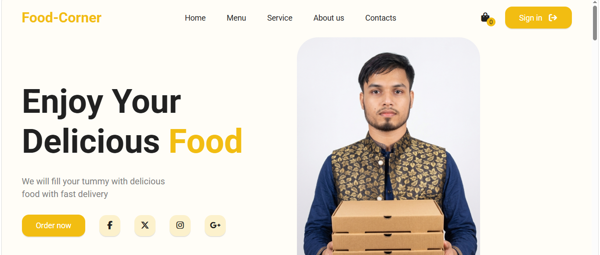

# 🍔 Food Corner

A modern and responsive Food Corner website built using **HTML5**, **CSS3**, and **JavaScript**. This project is designed with a clean UI, smooth layout, and responsive design for different screen sizes.

## 🚀 Live Demo

🔗 https://food-corner-site.netlify.app/

## 📸 Preview

> Add a screenshot of your project here.

Example:



## ✨ Features

- 🌐 Responsive Design
- 🎨 Modern User Interface
- 📱 Mobile Friendly
- 🏠 Home Section
- 🍔 Food Menu
- 🛒 Shopping Cart
- 📦 Order Section
- 🚚 Delivery Service
- ⭐ Customer Reviews
- 📞 Contact Section
- ⚡ Fast and Smooth User Experience

## 🛠️ Technologies Used

- HTML5
- CSS3
- JavaScript

## 📂 Project Structure

```text
food-corner/
│── index.html
│── style.css
│── script.js
│── images/
|── products.json
└── README.md
```

## 💻 Getting Started

1. Clone the repository

```bash
git clone YOUR_GITHUB_REPOSITORY_LINK
```

2. Open the project folder.

3. Run `index.html` in your browser.

## 📚 What I Learned

- Semantic HTML
- CSS Flexbox
- Responsive Web Design
- JavaScript DOM Manipulation
- Cart Functionality
- Project Structure
- Git & GitHub Basics
- Netlify Deployment

## 👨‍💻 Author

**Yeasin Arafat**

- GitHub: https://github.com/yeasin-arafat40

---

⭐ If you like this project, don't forget to give it a star!